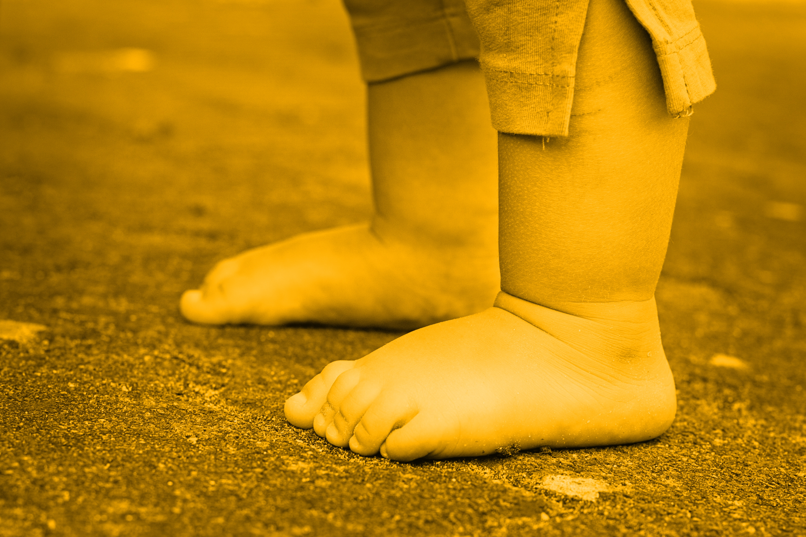

<!---
To-do:
- edited questions to a more "general" language, but looks imprecise.
- "sign up" page: Emailed PSA
	- create the sign up/registration form
- open external links in new tabs? possible work around with kramdown - apply to all pages
- map: see "about"

- Notes:
	- logo: added color-blind friendly colors, from Wong (https://www.nature.com/articles/nmeth.1618.pdf?origin=ppub)
	- Project link images: color-blind friendly from Wong.
--->

**ManyBabies** is a collaborative project for replication and best practices in developmental psychology research. Our goal is to bring researchers together to address difficult outstanding theoretical and methodological questions about the nature of early development and how it is studied. For example:

<!--- Do infants prefer agents who are seen to help over those who are seen to hinder?-->
- Infants prefer helpers or hinders?
<!--- What factors shape infants’ preferences for familiar and novel stimuli? -->
- Infants prefer novel or familiar stimuli?
<!--How does Infant Direct Speech preference vary across age?-->
- Is Infant Direct Speech is more appealing to infants than Adult Directed Speech?

<!--- Do infants show anticipatory looking that reflects the false belief of another agent?-->

Learn more about **MB** origin, goals, and people [here]({{site.baseurl}}/about/).  
Check the latest [news]({{site.baseurl}}/news/) to stay up to date.

***

<!--
html to create a grid and add Projects info
images with link MUST use the class = "image" (.css from ManyPrimates)
-->

<section>
	<header class="major">
		<h1>Projects</h1>
	</header>
      

        The broader goals of <b>ManyBabies</b> come together in a set of collaborative projects. Which can be of three types: <i>main</i>, <i>spin-off</i>, and <i>secondary analysis</i>. Learn more and see a list of ongoing projects <a href="{{site.baseurl}}">here</a>.
      

      

        Main projects are listed below, please note that they can be Empiric or Methodologic in nature. Spin-off and secondary analysis for each project are contained under these pages.
      

	<header class="major">
			<h3>Empiric</h3>
	</header>

 

  

    

        

          
          <h4>MB1: Infant-Directed Speech Preference</h4>
            Do infants have a preference for infant-directed speech? How does this preference vary across age, method, and native language background?
              <a href="{{site.baseurl}}" class="button">Learn more</a>
        

        

          
          <h4>MB2: Theory of Mind in Infancy</h4>
            Do infants show anticipatory looking that reflects the false belief of another agent?
                <a href="{{site.baseurl}}" class="button">Learn more</a>
        

  	

 

    

        

          
          <h4>MB3: Rule Learning</h4>
            Do infants learn and generalize identity-based rules from speech stimuli?
              <a href="{{site.baseurl}}" class="button">Learn more</a>
        

        

        
        <h4>MB4: Moral Evaluation</h4>
          Do infants prefer agents who are seen to help over those who are seen to hinder?
              <a href="{{site.baseurl}}" class="button">Learn more</a>
        

    

 

    

        

          
          <h4>MB5: The Hunter & Ames model</h4>
            What factors shape infants’ preferences for familiar and novel stimuli?
              <a href="{{site.baseurl}}" class="button">Learn more</a>
        

		

	

 
	<header class="major">
			<h3>Methodologic</h3>
	</header>
 

	

		

        

        
        <h4>MB-AtHome</h4>
          Work towards solutions for testing infants in their home, with a focus on measuring looks.
              <a href="{{site.baseurl}}" class="button">Learn more</a>
        

    

  

</section>

***

# Publications

Check out the **ManyBabies** [reports and conference presentations]({{site.baseurl}}/publications/).

***

# Get involved

We encourage everyone who is interested in developmental research to get involved! Please note that access to infants/infant lab is **not** a prerequisite. There are several ways to [learn more and contribute]({{site.baseurl}}/get_involved/).
