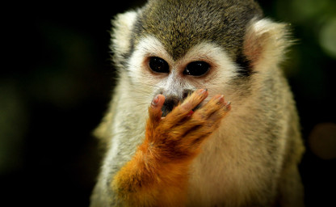
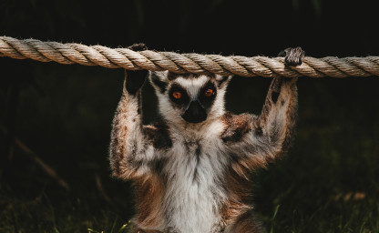

<!-- Section -->
<section>
	<header class="major">
		<h2>Get involved</h2>
	</header>
	

		<article>
			
			

				<h3>News</h3>
				
<strong>Aug 2018</strong>: The project was officially launched at the 27th International Primatological Society Congress in Nairobi, Kenya!

			

		</article>
		<article>
			
			

				<h3><a href="{{ 'authorship.html' | absolute_url }}">Authorship Guidelines</a></h3>
				
As a large scientific collaboration that aims to be inclusive, we are currently developing guidelines and criteria for how to assign authorship to individuals involved in ManyPrimates projects.

			

		</article>
		<article>
			
			

				<h3><a href="{{ 'ethics.html' | absolute_url }}">Ethics Guidelines</a></h3>
				
We are currently developing ethical guidelines for cognitive research with captive primates in general as well as for specific concerns that sanctuaries may have about the use of primates in research.

			

		</article>
		<article>
			
			

				<h3><a href="mailto:{{ site.email }}" target="_blank">Contact</a></h3>
				
We encourage everyone who is interested in primate cognition to get involved. Access to primates is <strong>NOT</strong> a prerequisite.

			

		</article>
	

</section>

<!-- Section -->
<section>
	<header class="major">
		<h2>Projects</h2>
	</header>
	

		<article>
			
			<h3>Pilot</h3>
			
As a proof of concept, this study was a first step towards building an infrastructure that facilitates large-scale collaboration in primate cognition research. In this pilot study, we conducted a short-term memory task with 187 primates from 12 species and 13 sites. 

			<ul class="actions">
				<li><a href="{{ 'pilot.html' | absolute_url }}" class="button">Learn more</a></li>
			</ul>
		</article>
		<article>
			
			<h3>ManyPrimates 1: Short-Term Memory</h3>
			
The first ManyPrimates project is a continuation of our <a href="{{ 'pilot.html' | absolute_url }}">pilot study</a>. We hope to increase the number of species and individuals per species in order to make meaningful inferences about the evolution of short-term memory abilities in the primate lineage.

			<ul class="actions">
				<li><a href="{{ 'project1.html' | absolute_url }}" class="button">Learn more</a></li>
			</ul>
		</article>
		<article>
			
			<h3>ManyPrimates 2</h3>
			
We are currently collecting ideas for the second ManyPrimates project. If you are interested in joining the project, please <a href="mailto:{{ site.email }}" target="_blank">get in touch</a>.

			<ul class="actions">
				<li><a href="{{ 'project2.html' | absolute_url }}" class="button">Learn more</a></li>
			</ul>
		</article>
	

</section>
