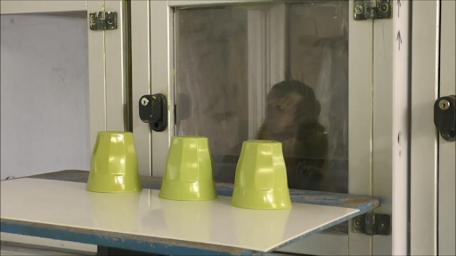
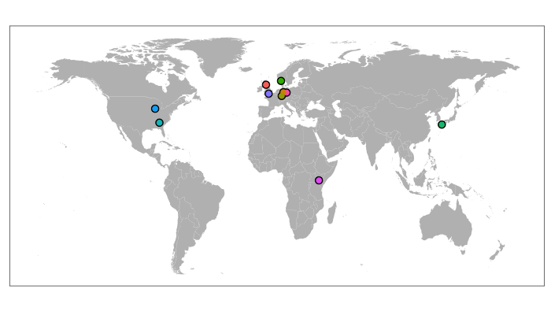
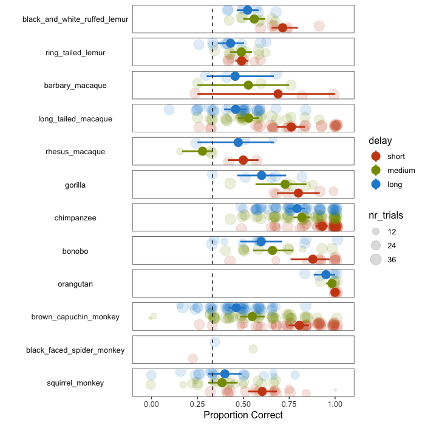

## Establishing an infrastructure for collaboration

The main goal of the ManyPrimates project is to build an infrastructure that facilitates collaboration in primate cognition research. As a first step towards this goal, we decided to run a pilot study. We wanted to make some important experiences (and mistakes) that would prepare us for the studies to come. Furthermore, the pilot study should serve as a proof of concept, showing that large-scale collaboration in primate cognition research is possible. Finally, by collecting some interesting data, we hoped to get more people excited about the project and also convince them to join. 

***

## The study: Short-term memory

In early 2018, we collected a number of potential study ideas and, after some discussions, took a vote and decided on short-term memory as the topic of the pilot study. Short-term memory is a fundamental cognitive ability and therefore seemed to be a suitable and interesting starting point for ManyPrimates. We used a study design that had been successfully used with a number of different primate species before. The setup involved three inverted cups as hiding locations. The experimenter hid a food reward under one of the cups and the participant's task was to remember this location. Here is a picture from the setup at Edinburgh Zoo.

 

We varied the length of the delay between hiding and retrieval: In the short delay condition, participants were allowed to choose one of the cups immediately after the hiding. In the medium delay condition they had to wait for 15s and in the long delay condition they had to wait for 30s. We expected a retention effect with participants choosing the correct cup less often after longer delays. After preregistration of the methods and analysis, data was collected between March and August 2018.

***

## Some preliminary results

The projects and the results from the pilot study were first presented to a wider audience in late August 2018 at the 27th International Primatological Society Congress in Nairobi, Kenya. In total, 187 primates from 12 species and 13 sites participated in the study. The map below shows the participating institutions.

The graph below gives an overview of the results from the pilot study. For each species, it shows the performance in the three delay conditions. Transparent dots represent aggregated data for each individual by condition. Solid dots are species means for a given condition. Error bars show 95% confidence intervals (CI). The dotted line represents level of correct choice expected by chance. As a rough rule for inference, performance is significantly different from chance if the CI does not overlap with the chance line. Species are grouped by phylogeny, with lemurs on top, followed by old world monkeys, apes and new world monkeys.

Looking at this graph, one can see a number of things. First of all, there is a lot of variability with respect to the number of participants from each species. For example, we have a fairly large number of chimpanzees but only one spider monkey in the sample. Second, we can see that most of the species means across conditions fall on the right side of the chance line, suggesting that, across conditions, primates were able to remember the hiding location. Finally, the proportion of correct choices in the medium and long delay conditions is lower compared to the short delay condition. This is evidence for the retention effect we expected to find.

***

## Next steps

The pilot study was an important step towards the goal of establishing an enduring infrastructure for collaboration in primate cognition research. Even though the sample size and number of species we tested is quite substantial, it is still relatively small in order to make inferences about the phylogenetic development of short-term memory in primates. We therefore decided to continue collecting data for this study to reach a larger and more balanced sample. The pilot study lives on as [ManyPrimates1](project1.html "ManyPrimates1"). 

